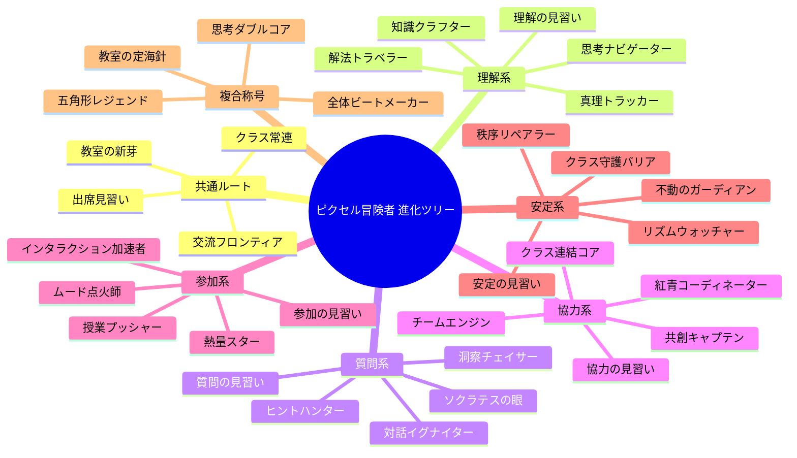

# ClassVibe 称号・アバター進化ツリー（日本語版）



## 解放ルール（実装向け）
- 基本: レベル帯で共通称号を順次解放
- 分岐: 5次元（理解/質問/協力/参加/安定）の最高値で主分岐を決定
- 複合: 上位2次元の差が10%以内なら複合称号を優先
- 最終: 5次元すべて20以上で「五角形レジェンド」
- アバター方針: マスコット連動ではなく、アニメ調ピクセルの冒険者キャラクター連動

## アセット生成
- 設定: `design/title_system_ja.json`
- 生成スクリプト: `design/generate_title_avatars_ja.py`
- 生成先: `design/assets/avatars_ja/`

```bash
python3 design/generate_title_avatars_ja.py
```
